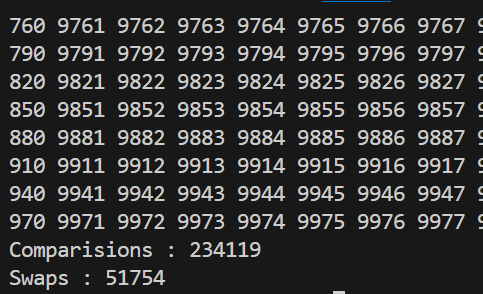

## Randomized Quick Sort
---
>### Randomizer
```c++
// Generate Random number in between p and r :

int getRandom(int l, int h) {    
    srand(time(0));
    return (rand() % (h - l + 1)) + l;
}
```
>### Partition Function : last element as pivot
```c++
int partition(vector <int> &v, int l, int h){

    // Take last element as pivot 
    int pivot = v[h];

    int i = l;
    for(int j = l; j < h;j++){
 
        if(v[j] <= pivot){
            swap(v[i], v[j]);
            i++;
        }
    }
    swap(v[i], v[h]);

    return i;
}
```
>### Randomized Quick Sort
```c++
void quickSort(vector <int> &v, int l, int h){
    
    if(l < h){
        // Swap last element of array with any other element of array 
        int random = getRandom(l, h);
        swap(v[random], v[h]);

        int q = partition(v, l, h);
        quickSort(v, l, q - 1);
        quickSort(v, q + 1, h);
    }
    
    return;
}
```

>### Output : 
For n = 10000
|Run|Output|
|---|---|
|1.| |
|2.||

|Simple Quick Sort|Randomized Quick Sort|
|---|---|
