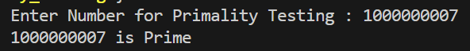
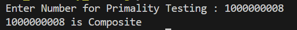
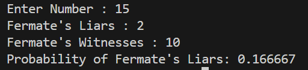
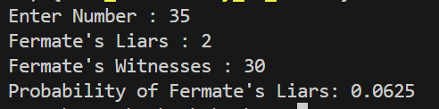

# Fermate's Theorem : Primality Testing 
>

```c++
using USLLI = unsigned long long int;
```
### Random Number : [l, h]
```c++
// Generate Random number in between l and h :
USLLI getRandom(USLLI l, USLLI h)
{
    srand(time(0));
    return (rand() % (h - l + 1)) + l;
}
```

>### GCD using Euclid's Iterative Algorithm :
```c++
USLLI gcd(USLLI a, USLLI b)
{

    while (b != 0)
    {
        USLLI res = a % b;
        a = b;
        b = res;
    }

    return a;
}
```
>### Power Function
```c++
USLLI power(USLLI a, USLLI x, USLLI n)
{
    USLLI res = 1;

    while (x > 0)
    {

        // Odd

        if (x % 2 == 1)
        {
            res = (res * a) % n;
        }

        x = x / 2;

        a = (a * a) % n;
    }

    return res;
}
```

>### Primality Test 
```c++
// as k increases, probability of correct ans increases
int k = 100;

bool isPrime(USLLI n)
{

    if (n <= 1 || n == 4)
        return false;

    if (n <= 3)
        return true;

    while (k > 0)
    {
        
        USLLI a = getRandom(2, n - 2);

        if (gcd(n, a) != 1)
            return false;

        if (power(a, n - 1, n) != 1)
            return false;

        k--;
    }

    return true;
}
```
>Output 

|Input|Output|
|---|---|
|n = 1000000007 ||
|n = 1000000008 ||

# Probability Of Liars


>Output 

|Input|Output|
|---|---|
|n = 15||
|n = 34||
